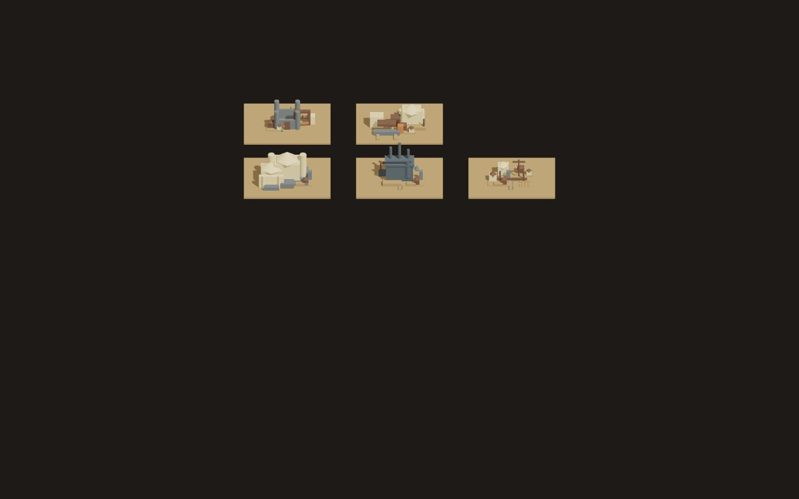
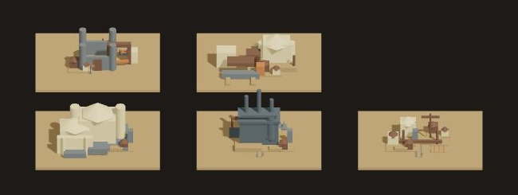

# 06 World Art Gallery QA

## REVIEW_TARGET

| Field | Value |
|---|---|
| target branch | `parallel-p0-world-art-v2` |
| target SHA | `fd46de162b81814a1c61caccaf09ab4a31641738` |
| QA branch | `parallel-p0-visual-qa-v2` |
| QA branch at review start | `ab29719514ac3f058ce4f967082a1449128b9f70` |
| reviewed component | `src/app/mapVisual/WorldArtGallery.tsx` |
| deployed source | 해당 없음. exact target SHA의 local Vite 실행 화면 |
| browser URL | `http://127.0.0.1:5180/qa-world-art-gallery.html?mapLabels=0` |
| viewport | `1440×900 CSS px` |
| devicePixelRatio | `1` |

이번 review는 production runtime map이 아니라 target commit의
authoring-only `WorldArtGallery`를 실제 browser Canvas로 렌더한 visual QA다.
별도 gallery baseline screenshot은 제공되지 않아, 이전 rolling map screenshot과
pixel diff를 주장하지 않고 target 화면을 labels-off acceptance rubric에 대입했다.

## EXECUTION_PROOF

target SHA를 detached temporary QA worktree에서 실행하고, target에 없는 다음
untracked entrypoint만 임시로 추가했다. target production source에는 commit하지
않았다.

```text
qa-world-art-gallery.html
src/qaWorldArtGallery.tsx
```

실행된 target-specific tests:

```text
npx vitest run src/app/mapVisual/worldArtGallery.test.ts src/presentation/mapVisual/proceduralKitGeometry.test.ts --reporter=verbose
2 test files passed / 3 tests passed
```

browser에서 확인된 render metadata:

```text
data-world-art-gallery = true
data-preview-only = true
data-labels = off
body.innerText = ""
gallery root rect = 0,0 1440×640
Canvas rect = 0,0 1440×640
document horizontal overflow = 0px
document vertical overflow = 0px
```

gallery panel order는 target source의 `regionCompositionRoles()`와 camera
projection을 기준으로 다음처럼 판독했다. screenshot에는 이 텍스트가 렌더되지
않았다.

```text
상단 좌: frontier       상단 우: agrarian-distribution
하단 좌: capital        하단 중: industrial       하단 우: port
```

## SCREENSHOT_EVIDENCE





| Evidence | Dimensions | SHA-256 |
|---|---:|---|
| `evidence/06-world-art-gallery-1440x900-labels-off.png` | 1440×900 | `BB6EDB1F30E0BDC4DC609D9D89CC6ACE630122A67548D94B2E8E9A7EEF8F26C3` |
| `evidence/06-world-art-gallery-1440x900-labels-off-panels.png` | 650×245 | `CDE811D3AAF7005C87B519C6AC517A42B8B6EC630C1CF892443133DDE8088A5A` |

full capture에서는 gallery component의 고정 `height: 640px` 아래로 약 260px의
empty viewport가 남는다. panel crop은 식별을 위한 보조 evidence이며, 판정은
실제 1440×900 full capture를 기준으로 했다.

## LABELS_OFF_RECOGNITION

| Class | 판정 | 화면 근거 | player consequence |
|---|---|---|---|
| capital | **PASS** | 하단 좌측 palace cluster가 다른 cluster보다 밝고 크며, 중앙 hall·좌우 수직 tower·terrace가 하나의 civic landmark로 읽힌다. | labels 없이도 정치적 중심 후보를 지목할 수 있다. |
| industrial | **PASS** | 하단 중앙의 dark iron hall과 서로 다른 높이의 3개 chimney가 즉시 보인다. | 생산/공장 region임을 1차 식별할 수 있다. 단, richer industrial geography는 아래 polish 판정에서 닫히지 않았다. |
| port | **FAIL** | 하단 우측에 선형 beam, posts, mast/crane는 있으나 물가, 수면, shoreline, 배의 관계가 없다. 동일한 tan plate 위의 wooden scaffold처럼 읽힌다. | 항구와 일반 목재 구조물을 구분하지 못해 trade gateway를 놓친다. |
| frontier | **PARTIAL** | 상단 좌측은 fort-like wall과 수직 corner-tower silhouette가 있지만, gate opening·border edge·rough ground가 작은 화면에서 즉시 분리되지 않는다. industrial chimney cluster와도 혼동 가능하다. | 국경 방어/변경 위험의 위치를 첫 glance에 확정하기 어렵다. |
| agrarian/distribution | **FAIL** | 상단 우측의 pale block와 낮은 horizontal pieces는 field/open production 면, granary silo, distribution lane의 조합으로 읽히지 않는다. | 곡창·배급 생활권을 generic civic/warehouse cluster와 구분하지 못한다. |

labels-off blind 결론은 `2 PASS / 1 PARTIAL / 2 FAIL`이다. data model의
role/displayName이나 source comment를 보고 맞힌 것이 아니라, 실제 screenshot
silhouette를 본 뒤 target source order로 panel identity를 대조했다.

## OBJECT_AND_MATERIAL_RUBRIC

| 항목 | 판정 | exact screen / component | QA observation |
|---|---|---|---|
| palace > project > POI > settlement > prop scale hierarchy | **PARTIAL** | `WorldArtGallery` → `GalleryPanel` → `KitGroup` | 의도된 relative scale은 보이지만 industrial chimney와 frontier vertical pieces가 palace의 civic mass와 height competition을 만든다. gallery plate가 동일하고 작은 viewport에서 prop/landmark의 visual height가 rank를 흐린다. |
| primitive/blockout dominance | **FAIL** | `WorldArtGallery.tsx`의 `PrimitiveMesh`; box/cylinder/cone kit 전체 | full capture와 crop 모두 object language가 단순 box/cylinder/cone에 머물고, 물·지형 relief·도로·건축 재질의 secondary detail보다 blockout mass가 먼저 보인다. |
| five Region silhouettes are distinct | **PARTIAL** | 5개 `GalleryPanel` | capital/industrial/port는 구별되지만 frontier는 industrial과 vertical silhouette가 겹치고 agrarian은 pale generic cluster에 가깝다. 1440×900 full view에서는 각 panel이 작아 차이가 더 약해진다. |
| material family reads as one world | **PASS** | `GalleryPanel` tan ground + `MAP_MATERIAL_FAMILIES` | muted earth/stone/civic/iron/timber palette와 동일한 low-poly light/shadow treatment가 하나의 authoring world로 묶인다. 다만 port에 water family가 없어 장소 의미는 약하다. |
| objects grounded | **PASS** | `PrimitiveMesh` cast/receive shadow와 panel top | screenshot에서 각 cluster가 tan plate 위에 접촉 shadow를 갖고 있어 명백하게 떠 보이는 object는 관찰되지 않았다. |
| port as waterside/dock | **FAIL** | 하단 우측 `port` panel / `port-dock` kit | pier/post/mast/crane shape는 있으나 물가가 없어 dock이 아니라 scaffold/yard로 읽힌다. |
| industrial richer than chimney box | **FAIL** | 하단 중앙 `industrial` panel / `factory-iron-works` kit | recognition은 PASS지만 실제 첫 read는 큰 iron box + 3 chimney다. works-yard, furnace, crane, mine/haul geography가 panel scale에서 secondary로 사라진다. |
| frontier fort/gate immediate | **FAIL** | 상단 좌측 `frontier` panel / `fort` + `checkpoint-gate` kit | fort-like block은 보이지만 gate opening과 border context가 즉시 읽히지 않는다. industrial과 오인할 수 있다. |
| capital as strongest landmark | **PARTIAL** | 하단 좌측 `capital` panel / `palace` kit | palace가 가장 큰 밝은 civic mass로 읽히지만 industrial chimney의 최고점이 높아 vertical attention을 경쟁한다. “가장 강한 landmark”가 면적·명도·높이에서 동시에 안정적이지 않다. |

## FAIL_RECORDS

### WAG-P0-01 — port waterside identity missing

- 판정: **FAIL**
- screenshot/evidence: `evidence/06-world-art-gallery-1440x900-labels-off.png`,
  `evidence/06-world-art-gallery-1440x900-labels-off-panels.png`
- exact component/screen: `src/app/mapVisual/WorldArtGallery.tsx`의 하단 우측
  `GalleryPanel(role: "port")`, `KitGroup(family: "port-dock")`
- player consequence: labels OFF에서 port가 trade/water gateway가 아니라 일반
  wooden scaffold로 보인다. 항구의 strategic geography를 찾을 수 없다.
- severity: **P0**
- recommended owner: **02_WORLD_ART**
- recommended direction: water/shoreline contrast, pier-to-water relation, dock
  edge와 ship/cargo cue를 같은 ground context에서 읽히게 한다.

### WAG-P0-02 — agrarian/distribution identity missing

- 판정: **FAIL**
- screenshot/evidence: `evidence/06-world-art-gallery-1440x900-labels-off.png`,
  `evidence/06-world-art-gallery-1440x900-labels-off-panels.png`
- exact component/screen: `src/app/mapVisual/WorldArtGallery.tsx`의 상단 우측
  `GalleryPanel(role: "agrarian-distribution")`, `field-plot`,
  `granary-storehouse`, `distribution-yard` placement
- player consequence: open-field food production과 distribution yard가
  generic pale building cluster로 축약되어 지역의 생산·배급 역할을 읽지 못한다.
- severity: **P0**
- recommended owner: **02_WORLD_ART**
- recommended direction: open field plane, visible furrows/water runoff, silo/store
  profile, loading lane/yard를 하나의 horizontal production silhouette로 강화한다.

### WAG-P0-03 — frontier fort/gate does not immediately read

- 판정: **FAIL**
- screenshot/evidence: `evidence/06-world-art-gallery-1440x900-labels-off-panels.png`
- exact component/screen: `src/app/mapVisual/WorldArtGallery.tsx`의 상단 좌측
  `GalleryPanel(role: "frontier")`, `fort` + `checkpoint-gate`
- player consequence: border defense와 passage choke point가 industrial stack과
  구분되지 않아 frontier risk를 빠르게 위치시킬 수 없다.
- severity: **P0**
- recommended owner: **02_WORLD_ART**
- recommended direction: wall perimeter와 gate void를 silhouette로 열고, rough
  ridge/outer edge/approach path를 같은 panel 안에서 fort와 연결한다.

### WAG-P1-01 — industrial read collapses to chimney box

- 판정: **FAIL**
- screenshot/evidence: `evidence/06-world-art-gallery-1440x900-labels-off-panels.png`
- exact component/screen: 하단 중앙 `GalleryPanel(role: "industrial")`,
  `factory-iron-works` procedural kit
- player consequence: 산업 region은 알아볼 수 있지만 “무엇을 생산하고 어떻게
  연결되는가”가 보이지 않아 strategic landmark가 generic blockout으로 남는다.
- severity: **P1**
- recommended owner: **02_WORLD_ART**
- recommended direction: works hall의 yard/furnace/haul path를 chimney와 같은
  prominence로 설계하지 말고, ground footprint와 material variation으로
  production axis를 먼저 읽힌다.

### WAG-P1-02 — primitive/blockout treatment remains dominant

- 판정: **FAIL**
- screenshot/evidence: full capture와 panel crop 전체
- exact component/screen: `PrimitiveMesh`의 `box`, `cylinder`, `cone` renderer와
  모든 `KitGroup`
- player consequence: five semantic roles보다 low-poly construction primitive가
  먼저 보여 authoring placeholder를 실제 world landmark처럼 읽기 어렵다.
- severity: **P1**
- recommended owner: **02_WORLD_ART**
- recommended direction: replacement seam은 유지하되 role별 organic profile,
  surface breakup, water/field/stone/wood contact detail을 추가하여 primitive가
  최종 visual identity가 되지 않게 한다.

## P1_POLISH

| ID | 판정 | 근거 | owner |
|---|---|---|---|
| WAG-P1-03 | **PARTIAL** scale hierarchy | palace mass는 strongest에 가깝지만 chimney/mountain verticals가 height hierarchy를 흔든다. | `02_WORLD_ART` |
| WAG-P1-04 | **PARTIAL** five silhouette separation | frontier↔industrial, agrarian↔generic civic cluster 간 cue overlap. | `02_WORLD_ART` |
| WAG-P1-05 | **PARTIAL** gallery framing | target component의 640px fixed height가 900px viewport 하단에 약 260px empty backdrop을 남기고 panel cluster를 화면 중앙의 작은 sample처럼 만든다. | `INTEGRATION` |
| WAG-P1-06 | **PARTIAL** capital dominance | palace는 밝고 넓지만 strongest landmark 판정이 면적·높이·명도에서 한 방향으로 통일되지 않는다. | `02_WORLD_ART` |

## FINAL_JUDGMENT

| Review question | 판정 |
|---|---|
| labels OFF에서 capital 인식 | **PASS** |
| labels OFF에서 industrial 인식 | **PASS** |
| labels OFF에서 port 인식 | **FAIL** |
| labels OFF에서 frontier 인식 | **PARTIAL** |
| labels OFF에서 agrarian/distribution 인식 | **FAIL** |
| palace > project > POI > settlement > prop | **PARTIAL** |
| primitive/blockout dominance 해소 | **FAIL** |
| 5개 Region silhouette 차별화 | **PARTIAL** |
| material family one-world coherence | **PASS** |
| object grounding | **PASS** |
| port water/dock read | **FAIL** |
| industrial chimney-box 탈피 | **FAIL** |
| frontier fort/gate immediate read | **FAIL** |
| capital strongest landmark | **PARTIAL** |

이 target은 procedural art kit과 5개 role panel을 실제 Canvas에 렌더하는 데는
성공했지만, labels-off player recognition 기준은 닫히지 않았다. 특히 port,
agrarian/distribution, frontier의 공간적 identity가 부족하고, 전체 화면에서
primitive/blockout language가 여전히 dominant하다.

이 report는 `P0_PRODUCT_PASS`, `Gate1F`, `V02`를 선언하지 않는다.
